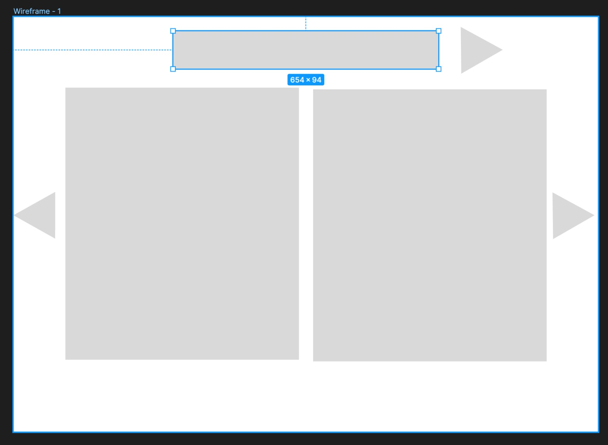

# Project Name: Tourist 
by Jihad, Redha, Marija ([website](https://theviision.github.io/audio_project.github.io/))

# Project Description:

"Tourist" is an immersive sound project designed to encapsulate the essence of arriving in a new city. Our vision was to create an experience that mirrors the journey of a tourist from the moment they land at the airport to their arrival at the hotel. 

The overall concept and theme revolve around exploration, discovery, and the transient feelings of being in a new place. By combining sound with a visual image carousel displayed on a website, we aimed to create a multi-sensory experience. The soundscapes are carefully crafted to represent different stages of the journey, while the image carousel provides visual context, enhancing the auditory experience and immersing the user deeper into the story of a tourist.

# Process:

The process of "Tourist" began with a foundational step of crafting a website mockup that served as a blueprint for the user interface and experience design. The attached mockup image represents our initial vision, laying out a structure that was both intuitive and engaging. Aimed to achieve a balance between aesthetics and functionality, the mockup was pivotal in guiding our development process because from there we could divide the responsibilities.

Implementing the concept required a collaborative effort, where responsibilities were clearly divided among team members to ensure a cohesive and immersive experience.

- Marija was responsible for the graphics. She curated and designed the visual elements that accompany the sound journey. Her work involved selecting images that matched the audio themes at different stages of the journey and editing each image with the stickman by using Illustrator and Photoshop.

- Jihad took on the role of website development. His primary responsibility was to integrate the soundscapes with the image carousel, ensuring that the website was not only functional but also user-friendly. He focused on creating a responsive design that would adapt to the soundscape, making sure the project could be properly broadcasted.

- Redha was in charge of sound. He carefully crafted and edited the soundscapes to represent the journey from the airport to the hotel accurately. This involved recording natural sounds, mixing, and producing the final audio tracks that would guide the user through the tourist's journey, paying attention to detail to ensure each sound evoked the intended emotions and atmosphere.

Also, we all contributed to the sound recording process. This collaborative effort ensured that we captured a wide array of sounds that accurately reflected the diversity and dynamism of the hotel. This collective approach allowed us to gather a comprehensive collection of sounds, enriching the project's auditory landscape and providing a more nuanced and detailed experience for the user.

The narrative mockup we used:
- Airport
  - Landing announcement (inside airplane)
  - Inside airport (crowded arrivals area)
- Taxi
  - Outside → getting in car
  - Inside car while driving
- Walking
  - Crowded sidewalk + footsteps
- Car Accident
  - Crash + people reacting
- Walking
  - Crowded sidewalk + footsteps
- Hotel
  - Bell (us) (Jihad)
  - Elevator (us) (Marija)
  - Key (us) (Redha)
  - Door (us) (Redha)
  - Bed  (us) (Jihad)                                                                                                                                                                                                                                                                                                                     

# Reflection/Evaluation:

Reflecting on the initial concept and the final execution of "Tourist," we believe our project met and, in some areas, exceeded our expectations. The collaborative effort between the graphics, website development, and sound design resulted in a cohesive and immersive experience that closely aligns with our initial vision.

One of the most significant achievements of this project is the seamless integration of sound with visual elements. The feedback highlighted the effectiveness of this combination in creating a compelling narrative that engages both the auditory and visual senses. This multi-sensory approach not only enriched the user experience but also set "Tourist" apart from conventional sound projects.

However, every project comes with its set of challenges. We encountered technical difficulties in synchronizing the sound with the image carousel, requiring us to rethink our approach and develop creative solutions. In addition to these technical hurdles, we also grappled with the aesthetic aspect of our website's design. Striking the right balance between a visually appealing interface and our main focus—the audio journey—was no easy feat. We were committed to ensuring the website did not lack in design appeal, yet we did not want it to overshadow the auditory experience we aimed to highlight. After much deliberation and iteration, we believe we have reached a harmonious design that is neither too stylized nor too plain, effectively complementing the immersive audio without competing for the user's attention.. 

The project served as a valuable learning opportunity, pushing us to innovate and problem-solve as a team. It reaffirmed our belief in the power of collaborative creativity and has set a foundation for future projects that aim to blend sound, visuals, and storytelling in engaging and meaningful ways.

